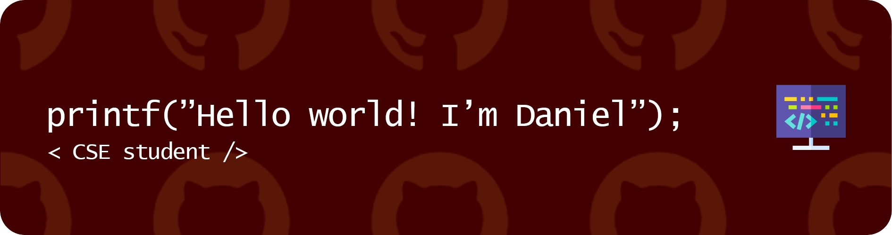

<!---->

<!--[;%3C%2F%2F+CSE+Student)](https://git.io/typing-svg)-->
<!--
```

▀██▀  ▀██▀ ▀██▀        ▀██▀  █ ▀██    ██▀    ▀██▀▀█▄       █     ▀█▄   ▀█▀ ▀██▀ ▀██▀▀▀▀█  ▀██▀      ▄█▄ 
 ██    ██   ██          ██      ███  ███      ██   ██     ███     █▀█   █   ██   ██  ▄     ██       ███ 
 ██▀▀▀▀██   ██          ██      █▀█▄▄▀██      ██    ██   █  ██    █ ▀█▄ █   ██   ██▀▀█     ██       ▀█▀ 
 ██    ██   ██          ██      █ ▀█▀ ██      ██    ██  ▄▀▀▀▀█▄   █   ███   ██   ██        ██        █  
▄██▄  ▄██▄ ▄██▄        ▄██▄    ▄█▄ █ ▄██▄    ▄██▄▄▄█▀  ▄█▄  ▄██▄ ▄█▄   ▀█  ▄██▄ ▄██▄▄▄▄▄█ ▄██▄▄▄▄▄█  ▄  
                 ▀█                                                                                 ▀█▀ 
                                                                                                        
```
--> 
<!--
[](https://git.io/typing-svg)
-->

<div align="center">


# About me 
My name is Daniel Ghindea, I'm 20 years old, undergraduate at [FACC](https://acs.pub.ro/en/), Politehnica [University](https://upb.ro/en/) of Bucharest.

Passionate about [photography](https://www.instagram.com/daniel_ghindea/) 📷 and [chess](https://www.chess.com/member/ghindea) ♟️.

<br>


# GitHub stats 


<!--[](https://github.com/ryo-ma/github-profile-trophy)-->

# Currently learning 
<div>


</div>

# Knowledge 
<div>


</div>
<br><br>
<!---->
<h3 align="center">
  <a href="https://github.com/Ghindea?tab=repositories" title="Show Repositories">🔎 Show More 🔍</a>
</h3>

<!--
### Visits


-->
<!---->
<!---->

</div>

<!---
**Ghindea/Ghindea** is a ✨ _special_ ✨ repository because its `README.md` (this file) appears on your GitHub profile.
Here are some ideas to get you started:
- 🔭 I’m currently working on ...
- 🌱 I’m currently learning ...
- 👯 I’m looking to collaborate on ...
- 🤔 I’m looking for help with ...
- 💬 Ask me about ...
- 📫 How to reach me: ...
- 😄 Pronouns: ...
- ⚡ Fun fact: ...
--->
